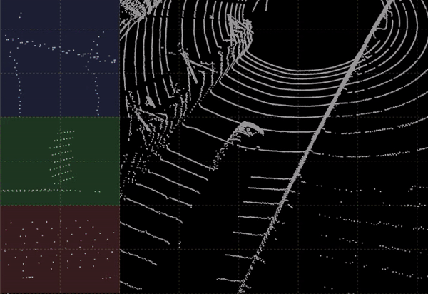
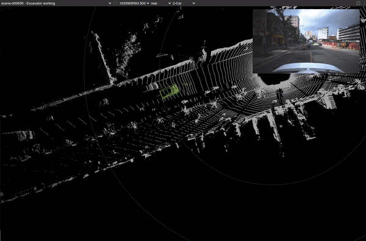

# NextPoints: Point Cloud 3D Bounding Box Annotation Tool

Forked from [SUSTech POINTS](https://github.com/naurril/SUSTechPOINTS)

## Introduction

NextPoints is a web-based tool for annotating 3D bounding boxes on point clouds and images. It supports various features such as interactive box editing, automatic yaw angle prediction, batch-mode editing, and more. The tool is designed to be user-friendly and efficient for annotating large datasets.

Different from SUSTech POINTS, NextPoints focuses on providing a more streamlined and intuitive user experience, making it easier for users to annotate their data quickly and accurately.

- use [FastAPI](https://fastapi.tiangolo.com/) as backend
- use [AWS S3](https://aws.amazon.com/s3/) for file storage
- supports custom ml backend for automatic box fitting and yaw angle prediction

### Main UI


### Automatic yaw angle (z-axis) prediction



### batch-mode box editing

semi-auto-annotation



## Features

- 9 DoF box editing
- Object type/ID/attributes editing
- Interactive/auto box fitting
- Batch-mode editing
- perspective/projective view editing
- Multiple camera images, with auto-camera-switching
- Binary/pcd files for point cloud data
- Jpg/png image files
- Objects/boxes/points coloring
- Focus mode to hide background to check details easily
- Stream play/stop
- Object ID generation

## Get started

```bash
git clone https://github.com/windzu/NextPoints.git
cd NextPoints
docker compose up -d
```

### Development

To run the development server, you can use:

1. use vscode Dev Container
   - Open the project in VSCode
   - Click on the green button in the bottom left corner and select "Reopen in Container"
   - This will set up the development environment automatically
2. start the fastapi server
   ```bash
   uvicorn app.main:app --host 0.0.0.0 --port 10081 --reload
   ```
3. start the celery worker
   ```bash
   celery -A app.celery_app worker --loglevel=info
   ```

Then open your browser and visit [http://localhost:10081](http://localhost:10081).

## Operations

[Operations](./doc/operations.md)

[Shortcuts(中文)](./doc/shortcuts_cn.md)

## Cite

If you find this work useful in your research, please consider cite:

```bash
@INPROCEEDINGS{9304562,
  author={Li, E and Wang, Shuaijun and Li, Chengyang and Li, Dachuan and Wu, Xiangbin and Hao, Qi},
  booktitle={2020 IEEE Intelligent Vehicles Symposium (IV)},
  title={SUSTech POINTS: A Portable 3D Point Cloud Interactive Annotation Platform System},
  year={2020},
  volume={},
  number={},
  pages={1108-1115},
  doi={10.1109/IV47402.2020.9304562}}

```
