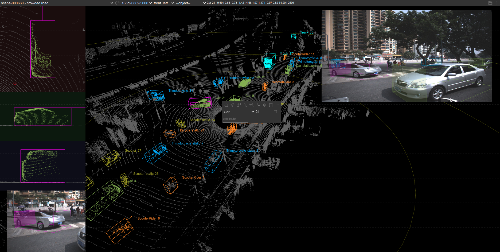
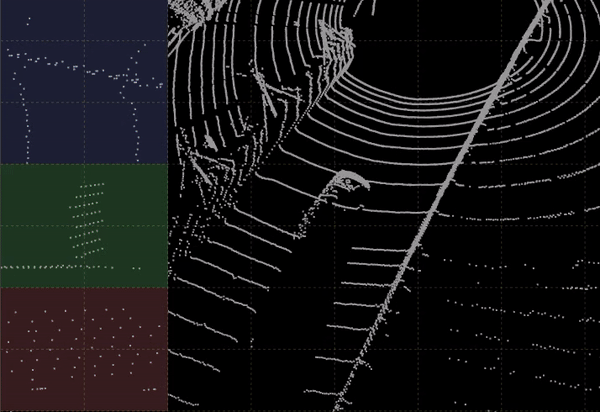
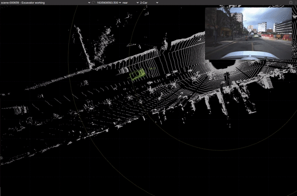

# SUSTechPOINTS: Point Cloud 3D Bounding Box Annotation Tool For Autonomous Driving

## 主界面



## yaw角自动旋转



## batch-mode box editing
>
> 半自动标注



## Features

- 9 DoF box editing
- Object type/ID/attributes editing
- Interactive/auto box fitting
- Batch-mode editing
- perspective/projective view editing
- Multiple camera images, with auto-camera-switching
- Binary/pcd files for point cloud data
- Jpg/png image files
- Objects/boxes/points coloring
- Focus mode to hide background to check details easily
- Stream play/stop
- Object ID generation

## 如何开始

- [通过源码安装(推荐)](./doc/install_from_source.md)
- [通过Docker安装](./doc/install_from_docker.md)
- [uwsgi](./doc/deploy_server.md)

## 操作指南

- [操作手册](./doc/operations_cn.md)
- [快捷键手册](./doc/shortcuts_cn.md)
- [最佳实践](./doc/best_practice_cn.md.md)

## 开发者指南

- [修改标注类别与属性](./doc/developer_guide_cn.md)

## Cite

If you find this work useful in your research, please consider cite:

```bash
@INPROCEEDINGS{9304562,
  author={Li, E and Wang, Shuaijun and Li, Chengyang and Li, Dachuan and Wu, Xiangbin and Hao, Qi},
  booktitle={2020 IEEE Intelligent Vehicles Symposium (IV)}, 
  title={SUSTech POINTS: A Portable 3D Point Cloud Interactive Annotation Platform System}, 
  year={2020},
  volume={},
  number={},
  pages={1108-1115},
  doi={10.1109/IV47402.2020.9304562}}
  
```
