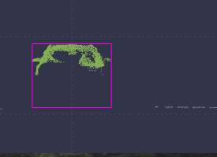
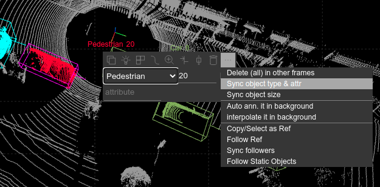

# 标注最佳实践
>
> 本文档内容是用于培训标注人员的标注最佳实践，在了解了标注工具的基本操作后，可以参考本文档进行标注,将会提高标注效率和标注质量.

## 最佳标注理念

- 按照目标物体标, 不要按帧标. 也就是一个目标物体在整个场景中全部标完后再标下一个物体.
- 要善用批量标注功能,提高标注效率

## 最佳标注步骤
>
> 下面是在一个场景中标注一个物体的最佳实践步骤

1. 打开一个场景后，先在多帧之间浏览一下一个场景长大概几十秒,一般经过间隔采样后大概包含几十帧原始数据(我们采集的数据是每秒10帧，每帧间隔50ms),所以帧与帧之间的同一个动态目标大概率会移动一段距离
2. 从一个场景的某帧中,选择一个目标物体进行标注,这个目标最好是在场景中视野最好的帧中，比如距离我们的采集车较近，无遮挡就满足要求,这种情况下可以比较准确的标出物体的**大小**和**方向**．如果挑选的目标离我们的车很远,点云会比较稀疏,而且有概率会被遮挡,这种情况就不适合作为标注的起始帧
3. 标好该目标的第一框后，可以使用复制/粘贴的方式把这个框迁移到上一帧或者下一帧，两帧都调整好后，可以启动批量标注功能(edit multiple instances)，这时候自动标注会对根据已经标注的几帧去预测该目标在其他帧中的位置．当然你也可以标完一帧后就开始批量标注，如果有问题再进行调整．不过还是建议最少先标两帧，这样在预测的适合方便估计物体初始速度，对自动标注时的追踪有帮助．
4. 在进行批量标的时候，自动标注算法大概率是会失败，比如找不到物体(追踪丢失等)，方向不正确,物体位置不正确等，这时需要手工对一些box进行调整，当人工精确的调整一个目标后,就将这个目标设置为`box finalize`,这代表已经人工确认过这个box是正确的,在后续的自动标注过程中,被人工确认过的box不会再被变动. 在人工调整一部分不准确的box后再尝试启用批量标注．这样反复操作几次后,这个目标就会被标注的差不多了. 在最后将不存在物体（被遮挡，或者太远看不见了）的物体或者是不符合我们标注需求的box删除．这样一个目标差不多就标注完毕了
5. 在标注完毕后,建议打开`trajectory`查看该物体在整个场景里面的轨迹，如果有异常（比如方向变化太大等）可以再次检查确认
6. 在最后点击finalize, save, exit, 完成一个物体在场景里面的标注．

## 标注小技巧

- 对于小目标的物体，如人，在标注的过程中可能不太容易分辩方向，可以根据其前进的方向，相对与建筑／路面的方向等进行辅助判断．

# FAQ

- 视图转来转去一段时间后, 就很难操作, 怎么办
  - 在主界面右键选择reset view, 会回到当前frame正中间, 从上向下俯视.

- 如何确定物体的方向(旋转)
  - 对于大型的车, 一般可以使用算法确定的方向, 然后微调.
  - 对于人, 有几种方法:
    - 可以先确定位置, 最后使用行进方向作为方向. (在multiple instance edit模式下, 右键/fit/moving direction), 然后根据情况微调. 如果人没有移动, 该方法不可使用.
    - 按照周围环境, 如路的方向, 借助图片, 确定方向,
    - 按照人的身形确定方向.

- 如何确定遮挡物体的大小
  - 在前后帧中寻找相对完整的场景, 从该帧开始标, 然后将大小迁移到其他帧.
    - multiple instance edit模式下, interpolate/auto等功能都是保持物体大小的, 只要有已经确定大小的帧就可以工作.
    - 普通模式下, 可以使用copy, paste的方式将box从一帧挪到另一帧.
    - 在用鼠标编辑box时, 按住shift, 可以保持box大小不变.
  - 没有可参考的其他帧数据，而且被遮挡，怎么确定大小
    - 根据环境：在侧试图或者后视图中，缩放视角，查看物体周围是否有地面线，如果有将box下边缘拉到地面线的位置. 如下图，后边的灰色线为地面线，可以据此确定box的下边界。
  
    

    - 根据物体的对称性，将边线拉到对称的位置
  
  - 查看对应的图片，如果是常见车型（如byd的的士），可以找到另外的同类型的车对应的box，复制粘贴，然后修改位置（不修改大小）
  - 实在没有任何办法的情况下，根据经验估计大小

- 如何修改类别
  
  如果某个object的类别标错了，又不想一个一个去修改，可以在某帧修改好之后，鼠标移到工具框的`...`然后选`Sync object type & attr`.

  

- multiple instance edit模式下, 有哪些操作方法
  - box选择, 使用鼠标可以选择多个操作对象
    - 单击: 选择/反选
    - Ctrl+单击: 选择/反选
    - shift+单击: 选择连续帧
    - 拖动: 选择多个帧
    - 鼠标右键可以选择当前帧前面的,后面的, 所有的帧
    - 注意鼠标如果在某个box的边线上点击时, 则是对box的编辑,不会进入选择功能
  - box选择后, 使用右键菜单, 可以进行如下功能
    - 删除
    - interploate 按线性移动速度方式插值
    - auto (no rotation) 自动（不旋转）
    - auto annotate 全自动

    - fit
      - size: 自动适配大小
      - position: 自动适配位置
      - rotation: 用ai算法调整方向
      - moving direciotn: 使用行进方向调整方向
      - 上述功能对应俯视图的4个按钮
    - finalize: 将所选box标记为人工编辑完成（后续自动算法运行时会作为重要的参考，而且自动算法不再会修改该box)
    - reload
    - goto this frame: 切换到普通模式,并切换到当前帧, 对应的box会选中
  - 右上角的按钮
    - `trajectory` 显示该物体在世界坐标系下的轨迹, 双击某个位置的box, 会退出并将对应的box选中.
    - 其他按钮跟右键菜单一样,但是针对所有的帧.
  - 显示屏有点小/大, 如果调整批量编辑的数量
    - 右上角config -> `Batch mode max box number`
    - 调整数量后, 如果显示的帧数少于场景总帧数, 请使用右上角按钮`next`/`previous`翻页
- 点云的点有点暗,看不清怎么办
  - 使用+/-调整点的大小, 或者在config菜单中修改(右上角按钮)
  
- box编辑功能
  - 快捷键列表 (俯视图/侧视图/后视图), 鼠标在某个视图上时,按键对该视图有效
    - a: 左移
    - s: 下移
    - d: 右移
    - w: 上移动
    - q: 逆时针旋转
    - e: 顺时针旋转
    - r: 逆时针旋转同时自动调整box大小
    - f: 顺时针选择同时自动调整box大小
    - g: 反向

  - 鼠标操作 (俯视图/侧视图/后视图)
    - 鼠标可以对每个试图对应的矩形边线,角,旋转方向进行拖动/双击, 产生对应编辑效果
    - 拖动 - 移动边线到鼠标位置
    - 双击 - 自动fit到最近的内点
    - shift+拖动 - 移动边线到鼠标位置,但是整个box大小保持不变
    - ctrl+拖动  - 拖动后, 从做后的位置,自动fit到物体最近的内点
  - 按钮
    - scale  - 自动调整大小
    - rotate - 自动调整方向，大小不变
    - move - 自动调整位置，大小和方向都不改变
    - I am lucky - 方向/大小/位置都自动调整
    - move direction - 使用物体的移动方向作为朝向，
      - 如果是运动物体, 且前后帧至少有一帧已经标注过，位置正确即可计算方向
      - 如果物体没有移动或者移动很缓慢,该功能不可使用
      - 如果是大型车辆, 速度慢且转弯时, 该功能也不可使用
